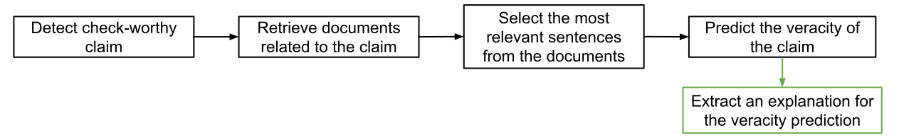

# Explainable Fact Checking: A Survey

This repository and [webpage](https://neemakot.github.io/project/survey) contain resources for the paper ["Explainable Fact Checking: A Survey" (Kotonya and Toni, 2020)](https://arxiv.org/abs/2011.****), which will be presented at The 28th International Conference on Computational Linguistics (COLING 2020). In the paper we give a critical review of the state of the art in automated fact-checking with a particular focus on explanations for fact-checking. 

## Introduction

Fact checking is the process of verifying claims in order to establish their veracity i.e., to distinguish between false stories (e.g., misattributions, rumours, hoaxes) and facts. 

Over the past few years the use of machine learning methods for fact-checking and fake news detection has become a popular topic of study. Indeed, several exciting breakthroughs have occured in automated fact checking thanks in large part due to new datasets (e.g., [FEVER](https://fever.ai/)) and advances in deep learning for NLP. However there are still some limitations in this research area, the one we focus on in this work in our work is __explanations__ for automated fact checking. 

The pipeline commonly employed for automated fact-checking consists of four parts (subtasks): 

	(1) Detecting checkworthy claims (i.e., identifying claims for fact-checking)

	(2) Retrieving evidence documents relevant to the claim.

	(3) Selecting the more important snippets of evidence from these documents.

	(4) Predicting the entailment relation between these evidence snippets and the claim. 

We propose that post-hoc explanations are an important and necessary extension of this pipeline.




## Data and results

For the complete data and results from our survey paper, please visit [this webpage](https://neemakot.github.io/project/survey).


## Reference

If you find our work useful, please cite the paper as formatted below.

```
@inproceedings{kotonya2020survey,
  title = "Explainable Automated Fact-Checking: A Survey",
  author = "Kotonya, Neema  and Toni, Francesca",
  booktitle = "28th International Conference on Computational Linguistics (COLING 2020)",
  publisher = "Association for Computational Linguistics",
  address = "Online",
  month = dec,
  year = "2020"
}
```

## Contact

Please feel free to contact [Neema Kotonya](mailto:nk2418@ic.ac.uk) if you have any queries.