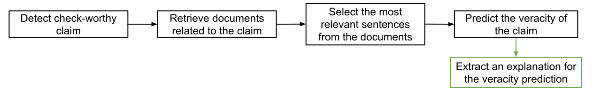

# Explainable Fact Checking: A Survey

This repository and the accompanying [webpage](https://neemakot.github.io/project/survey) contain resources for the paper ["Explainable Fact Checking: A Survey"](https://www.aclweb.org/anthology/2020.coling-main.474.pdf). In the paper, we offer a critical review of the state-of-the-art in automated fact-checking with a particular focus on interpretable fact-checking. 

We would like to keep the information in this repository up-to-date, so we welcome contributions. If you would like to contribute please read [CONTRIBUTING.md](CONTRIBUTING.md) to see how.


## Reference

If you find our work useful, please cite the paper as formatted below.

```bibtex
  @inproceedings{kotonya-toni-2020-explainable-automated,
    title = "Explainable Automated Fact-Checking: A Survey",
    author = "Kotonya, Neema  and
      Toni, Francesca",
    booktitle = "Proceedings of the 28th International Conference on Computational Linguistics",
    month = dec,
    year = "2020",
    address = "Barcelona, Spain (Online)",
    publisher = "International Committee on Computational Linguistics",
    url = "https://www.aclweb.org/anthology/2020.coling-main.474",
    pages = "5430--5443"
  }
```


## Contents

Here is an overview of papers mentioned in this work, and more recent papers which have been added.

- [Introduction](#introduction)
- [Fact Checking Datasets](#fact-checking-datasets)
  - [Naturally occuring claims](#naturally-occurring-claims)
    - [Social media (e.g., Twitter, Facebook)](#social-media)
    - [Fact-checking and news websites (e.g., Snopes, Politifact)](#fact-checking-and-news-websites)
  - [Hand crafted claims](#hand-crafted-claims)
    - [Wikipedia](#wikipedia)
    - [Scientific journals](#scientific-journals)

- [Fact Checking Systems Shared Task](#fact-checking-systems)
- [Explainable Fact Checking Systems](#explainable-fact-checking-systems)
  - [Explanation by attention mechanisms](#attention-mechanism)
  - [Explanation by rule discovery](#rule-discovery)
  - [Explanation by summarization](#summarization)
- [Adversarial Training for Automated Fact Checking](#adversarial-training-for-automated-fact-checking)
- [Multi-hop Fact Checking](#multihop-reasoning-for-facting-checking)
- [Surveys](#further-fact-checking-surveys)


## Introduction

Fact checking is the process of establishing the veracity of claims i.e., to distinguish between false stories (e.g., misattributions, rumours, hoaxes) and facts. 

Over the past few years the use of deep learning methods for fact checking and fake news detection have become a popular. Indeed, several exciting breakthroughs have occured in automated fact checking thanks in large part due to new datasets (e.g., [FEVER](https://fever.ai/)) and advances in machine learning for NLP. However there are still some limitations in this research area, the one we focus on in this work in our work is __explanations__ for automated fact checking. 

The pipeline commonly employed for automated fact-checking consists of four parts (subtasks). We propose that post-hoc explanations are an important and necessary extension of this pipeline.




For an overview of the data and results mentioned in our survey, please visit [this webpage](https://neemakot.github.io/project/survey).


## Fact Checking Datasets

List of fact checking, rumour verification and fake news detection datasets:

### Naturally occurring claims
  
#### Social media

* r/Fakeddit: A New Multimodal Benchmark Dataset for Fine-grained Fake News Detection [[Nakamura et al., LREC 2020]](https://www.aclweb.org/anthology/2020.lrec-1.755/)
[[DATA]](https://github.com/entitize/fakeddit) 
* SemEval-2019 Task 7: RumourEval, Determining Rumour Veracity and Support for Rumours [[Gorrell et al., SemEval 2019]](https://www.aclweb.org/anthology/S19-2147/) [[DATA]](https://competitions.codalab.org/competitions/19938) 
* All-in-one: Multi-task Learning for Rumour Verification [[Kochkina et al., COLING '18]](https://www.aclweb.org/anthology/C18-1288/) [[DATA]](https://figshare.com/articles/PHEME_dataset_for_Rumour_Detection_and_Veracity_Classification/6392078) †
* SemEval-2017 Task 8: RumourEval: Determining rumour veracity and support for rumours [[Derczynski et al., 2017]](https://www.aclweb.org/anthology/S17-2006/) [[DATA]](https://alt.qcri.org/semeval2017/task8/index.php?id=data-and-tools) 
* Hyperpartisan Facebook Pages Are Publishing False And Misleading Information At An Alarming Rate [[Silverman et al., 2017]](https://www.buzzfeednews.com/article/craigsilverman/partisan-fb-pages-analysis) [[DATA]](https://github.com/BuzzFeedNews/2016-10-facebook-fact-check)
* Detect Rumors in Microblog Posts Using Propagation Structure via Kernel Learning [[Ma et al., ACL 2017]](https://www.aclweb.org/anthology/P17-1066/) [[DATA]](https://www.dropbox.com/s/7ewzdrbelpmrnxu/rumdetect2017.zip?dl=0)
* Analysing How People Orient to and Spread Rumours in Social Media by Looking at Conversational Threads [[Zubiaga et al., 2016]](https://journals.plos.org/plosone/article?id=10.1371/journal.pone.0150989) [[DATA]](https://figshare.com/articles/PHEME_rumour_scheme_dataset_journalism_use_case/2068650) 
* CREDBANK: A Large-Scale Social Media Corpus with Associated Credibility Annotations [[Mitra and Gilbert, ICWSM 2015]](https://www.aaai.org/ocs/index.php/ICWSM/ICWSM15/paper/viewFile/10582/10509) [[DATA]](https://github.com/compsocial/CREDBANK-data) 

† This dataset is an extention of the PHEME rumour dataset.

#### Fact checking and news websites
  
* Explainable Automated Fact-Checking for Public Health Claims [[Kotonya and Toni, EMNLP 2020]](https://arxiv.org/abs/2010.09926) [[DATA]](https://github.com/neemakot/Health-Fact-Checking)
* STANDER: An Expert-Annotated Dataset for News Stance Detection and Evidence Retrieval [[Conforti et al., EMNLP Findings 2020]](https://www.aclweb.org/anthology/2020.findings-emnlp.365)[[DATA]](https://github.com/cambridge-wtwt/emnlp2020-stander-news)
* FakeCovid-- A Multilingual Cross-domain Fact Check News Dataset for COVID-19 [[Shahi and Nandini]](https://arxiv.org/abs/2006.11343) [[DATA]](https://gautamshahi.github.io/FakeCovid/)
* MultiFC: A Real-World Multi-Domain Dataset for Evidence-Based Fact Checking of Claims [[Augenstein et al., EMNLP 2019]](https://www.aclweb.org/anthology/D19-1475/) [[DATA]](https://competitions.codalab.org/competitions/21163) 
* A Richly Annotated Corpus for Different Tasks in Automated Fact-Checking [[Hanselowski et al., CoNLL 2019]](https://www.aclweb.org/anthology/K19-1046) [[CRAWLER]](https://github.com/UKPLab/conll2019-snopes-crawling) [[DATA]](https://tudatalib.ulb.tu-darmstadt.de/handle/tudatalib/2081)
* Integrating Stance Detection and Fact Checking in a Unified Corpus [[Baly et al., NAACL-18]](https://arxiv.org/abs/1804.08012) [[DATA]](https://alt.qcri.org/resources/arabic-fact-checking-and-stance-detection-corpus/)
* FakeNewsNet: A Data Repository with News Content, Social Context and Spatialtemporal Information for Studying Fake News on Social Media [[Shu et al., 2018]](https://arxiv.org/pdf/1809.01286.pdf) [[DATA]](https://github.com/KaiDMML/FakeNewsNet)
* “Liar, Liar Pants on Fire”: A New Benchmark Dataset for Fake News Detection [[Wang, ACL 2017]](https://www.aclweb.org/anthology/P17-2067/) [[DATA]](https://sites.cs.ucsb.edu/~william/software.html) 
* Truth of Varying Shades: Analyzing Language in Fake News and Political Fact-Checking [[Rashkin et al., EMNLP 2017]](https://www.aclweb.org/anthology/D17-1317/) [[DATA]](https://hrashkin.github.io/factcheck.html)
* The Fake News Challenge (Pomerleau and Rao, FNC-1 2017) [[DATA]](https://github.com/FakeNewsChallenge/fnc-1)


### Hand crafted claims / re-written statements 

#### Wikipedia
* TabFact: A Large-scale Dataset for Table-based Fact Verification [[Chen et al., ICLR 2020]](https://arxiv.org/abs/1909.02164) [[DATA]](https://github.com/wenhuchen/Table-Fact-Checking) 
* FEVER: a Large-scale Dataset for Fact Extraction and VERification [[Thorne et al., NAACL '18]](https://www.aclweb.org/anthology/N18-1074/) [[DATA]](https://fever.ai/resources.html) 
* Automated Fact-Checking of Claims from Wikipedia [[Sathe et al., LREC 2020]](https://www.aclweb.org/anthology/2020.lrec-1.849/) [[DATA]](https://github.com/wikifactcheck-english/wikifactcheck-english)
* Generating Fact Checking Briefs [[Fan et al., EMNLP 2020]](https://www.aclweb.org/anthology/2020.emnlp-main.580/)

#### Scientific journals
* Fact or Fiction: Verifying Scientific Claims [[Wadden et al., EMNLP 2020]](https://arxiv.org/abs/2004.14974) [[DATA]](https://github.com/allenai/scifact)


## Fact Checking Shared Tasks

* SciFact Claim Verifiation [[Wadden et al., 2020]](https://scifact.apps.allenai.org/)
* Fakeddit Multimodal Fake News Detection Challenge [[Nakamura et al., 2020]](https://competitions.codalab.org/competitions/25337#learn_the_details)
* SemEval-2019 Task 7: RumourEval, Determining Rumour Veracity and Support for Rumours [[Gorrell et al., 2019]](https://www.aclweb.org/anthology/S19-2147/)
* The Fake News Challenge (FNC-1) [[Pomerleau and Rao, 2017]](http://www.fakenewschallenge.org/)
  * A Retrospective Analysis of the Fake News Challenge Stance-Detection Task [[Hanselowski et al., 2018]](https://www.aclweb.org/anthology/C18-1158/)
* The Fact Extraction and VERification (FEVER) Shared Task [[Thorne et al., 2018]](https://www.aclweb.org/anthology/W18-5501/)
* SemEval-2017 Task 8: RumourEval: Determining rumour veracity and support for rumours [[Derczynski et al., 2017]](https://www.aclweb.org/anthology/S17-2006/)


## Explainable Fact Checking Systems

A list of works on explainability in fact-checking and fake news detection:

### Attention mechanism

* dEFEND: Explainable Fake News Detection [[Shu et al., KDD'19]](http://pike.psu.edu/publications/kdd19.pdf)
* GCAN: Graph-aware Co-Attention Networks for Explainable Fake News Detection on Social Media [[Lu and Li, ACL 2020]](https://www.aclweb.org/anthology/2020.acl-main.48/)
* DTCA: Decision Tree-based Co-Attention Networks for Explainable Claim Verification [[Wu et al., ACL 2020]](https://www.aclweb.org/anthology/2020.acl-main.97/)
* DeClarE: Debunking Fake News and False Claims using Evidence-Aware Deep Learning [[Popat et al., EMNLP 2018]](https://www.aclweb.org/anthology/D18-1003/)
* CredEye: A Credibility Lens for Analyzing and Explaining Misinformation [[Popat et al., WWW '18 Demo]](https://dl.acm.org/doi/10.1145/3184558.3186967)
* XFake: Explainable Fake News Detector with Visualizations [[Yang et al., Web Conf'19 Demo]](https://arxiv.org/abs/1907.07757)
* Credibility Assessment of Textual Claims on the Web [[Popat et al., CIKM'2017]](https://dl.acm.org/doi/10.1145/2983323.2983661)

### Rule discovery
* ExFaKT: A Framework for Explaining Facts over Knowledge Graphs and Text [[Gad-Elrab et al., WSDM'19]](https://dl.acm.org/doi/10.1145/3289600.3290996)
* Explainable Fact Checking with Probabilistic Answer Set Programming [[Ahmadi et al., TTO '19]](https://arxiv.org/abs/1906.09198) 


### Summarization
* e-FEVER: Explanations and Summaries for Automated Fact Checking [Stammbach and Ash, TTO'20]
* Generating Fact Checking Explanations [[Atanasova et al., ACL 2020]](https://www.aclweb.org/anthology/2020.acl-main.656/)
* Explainable Automated Fact Checking for Public Health Claims [[Kotonya and Toni, EMNLP 2020]](https://arxiv.org/abs/2010.09926)


## Adversarial Training for Automated Fact Checking

List of papers which look at adversarial training for robust fact-checking:

* Generating Label Cohesive and Well-Formed Adversarial Claims [[Atanasova et al., EMNLP 2020]](https://arxiv.org/abs/2009.08205)
* Evaluating adversarial attacks against multiple fact verification systems [[Thorne et al., EMNLP 2019]](https://www.aclweb.org/anthology/D19-1292/)
* DeSePtion: Dual Sequence Prediction and Adversarial Examples for Improved Fact-Checking [[Hidey et al., ACL 2020]](https://www.aclweb.org/anthology/2020.acl-main.761/)
* Fake news detection via NLP is vulnerable to adversarial attacks [[Zhou et al., ICAART 2019]](https://arxiv.org/abs/1901.09657)
* GEM: Generative enhanced model for adversarial attacks [[Niewinski et al., FEVER 2.0 @ EMNLP 2019]](https://www.aclweb.org/anthology/D19-6604/)
* FEVER Breaker’s Run of Team NbAuzDrLqg [[Kim and Allan, FEVER 2.0 @ EMNLP 2019]](https://www.aclweb.org/anthology/D19-6615/)

## Multihop Reasoning for Facting Checking

Multi-hop reasoning is closely important for explainability in fact-checking, recently there have been a number of papers which look to address this task:

* HoVer: A Dataset for Many-Hop Fact Extraction And Claim Verification [[Jiang et al., Findings of EMNLP 2020]](https://arxiv.org/abs/2011.03088)
* Multi-Hop Fact Checking of Political Claims [[Ostrowski et al., 2020]](https://arxiv.org/abs/2009.06401)
* Chains-of-Reasoning at TextGraphs 2019 Shared Task: Reasoning over Chains of Facts for Explainable Multi-hop Inference [[Das et al., TextGraphs-13 @ EMNLP 2019]](https://www.aclweb.org/anthology/D19-5313/)


## Surveys

Automated Fact Checking and Fake News Detection Surveys:

* A Survey of Fake News: Fundamental Theories, Detection Methods, and Opportunities [[Zhou and Zafarani, ACM Computing Surveys Sep '20]](https://dl.acm.org/doi/10.1145/3395046)
* A Review on Fact Extraction and VERification: The FEVER case [[Bekoulis et al., 2020]](https://arxiv.org/abs/2010.03001)
* A Survey on Natural Language Processing for Fake News Detection [[Oshikawa et al., LREC 2020]](https://arxiv.org/abs/1811.00770)
* Automated Fact Checking: Task Formulations, Methods and Future Directions [[Thorne and Vlachos, COLING'18]](https://www.aclweb.org/anthology/C18-1283/)
* Media-Rich Fake News Detection: A Survey [[Parikh and Atrey MIPR '18]](https://ieeexplore.ieee.org/abstract/document/8397049)
* Fake News Detection on Social Media: A Data Mining Perspective [[Shu et al., ACM SIGKDD Explorations Newsletter Sep 2017]](https://dl.acm.org/doi/abs/10.1145/3137597.3137600)
* Detection and resolution of rumours in social media: A survey [[Zubiaga et al., 2018]](https://dl.acm.org/doi/10.1145/3161603)

## Contact 

Please feel free to contact [Neema Kotonya](mailto:nk2418@ic.ac.uk) if you have any queries.

